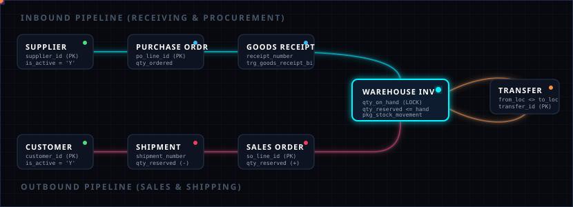

# Warehouse Management System (WMS) — Oracle PL/SQL Engine



---

## 🚀 Overview

A high-integrity **Warehouse Management System (WMS)** built on Oracle Database and PL/SQL. Designed to orchestrate the lifecycle of inventory across multiple warehouse facilities, handling suppliers, procurement, sales, fulfillment shipments, and inter-location stock transfers with full transaction logging and zero-loss concurrency locking.

---

## 📈 Stock & Transaction Pipeline

This database executes transaction flows through the pipeline shown below. Order allocations automatically update reservation levels, while physical transactions are processed atomically through PL/SQL packages:



---

## 🛠️ System Architecture & Schema Integrity

The database is built on a structured layer of constraints, triggers, and sequences to enforce strong business rule compliance at the data level.

### Database Objects Structure
| Script | Purpose | Description / Mechanics |
|---|---|---|
| [`00_drop_schema.sql`](file:///Users/arghy/Downloads/Desktop/WMS/00_drop_schema.sql) | Reset Schema | Drops views, packages, triggers, constraints, sequences, and tables. |
| [`01_create_tables.sql`](file:///Users/arghy/Downloads/Desktop/WMS/01_create_tables.sql) | DDL / Core Schema | Initializes table spaces, core columns, and primary keys. |
| [`02_constraints.sql`](file:///Users/arghy/Downloads/Desktop/WMS/02_constraints.sql) | Business Rules | Implements foreign keys, unique constraint maps, and CHECK constraints. |
| [`03_sequences_triggers.sql`](file:///Users/arghy/Downloads/Desktop/WMS/03_sequences_triggers.sql) | Automation & Auditing | Defines surrogate key sequences and automated column triggers. |
| [`04_indexes.sql`](file:///Users/arghy/Downloads/Desktop/WMS/04_indexes.sql) | Index Optimization | Indexes foreign keys, SKUs, and transaction lookup dimensions. |
| [`05_views.sql`](file:///Users/arghy/Downloads/Desktop/WMS/05_views.sql) | Reporting Views | Pre-built analytical queries for logistics and management metrics. |
| [`06_sample_data.sql`](file:///Users/arghy/Downloads/Desktop/WMS/06_sample_data.sql) | Test Dataset | Seed data spanning departments, employees, products, POs, and SOs. |
| [`07_packages.sql`](file:///Users/arghy/Downloads/Desktop/WMS/07_packages.sql) | PL/SQL Core API | `pkg_stock_movement` - encapsulates inventory adjustments and shipments. |

### Core Safety Features
* **Double-Safety Constraints (`chk_inv_qty_reserved`)**: Guarantees that `qty_reserved >= 0` and `qty_reserved <= qty_on_hand` at all times. This prevents phantom negative stocks or over-allocating orders.
* **Logical Loop Prevention**: Inter-warehouse stock transfers enforce `from_warehouse_id <> to_warehouse_id` (`chk_xfer_different_wh`) and inter-bin transfers enforce `from_location_id <> to_location_id` (`chk_xfl_different_loc`), eliminating self-referencing logical errors.
* **Auto-Generating Sequenced Keys**: Triggers like `trg_goods_receipt_bi` and `trg_shipment_bi` auto-generate format-padded codes (`GR-0000000001` or `SH-0000000001`) from thread-safe database sequences, resolving potential concurrency collisions in high-speed receiving environments.

---

## ⚡ PL/SQL Engine: `pkg_stock_movement`

All inventory changes occur within the transactional boundaries of the `pkg_stock_movement` package.

### Concurrency & Concurrency Locking
The system employs an optimistic-concurrency/row-locking strategy in its private procedure `apply_inventory_change`.
When inventory is altered (received, shipped, or adjusted), the procedure locks the corresponding row:
```sql
SELECT inventory_id, qty_on_hand
FROM   inventory
WHERE  product_id   = p_product_id
  AND  warehouse_id = p_warehouse_id
  AND  location_id  = p_location_id
FOR UPDATE;
```
* **`FOR UPDATE` locking**: Prevents concurrent database sessions from modifying the inventory level of the same SKU at the same bin location simultaneously. This eliminates lost updates and phantom negative inventory balances.
* **Auto-Inventory Creation**: Automatically instantiates inventory rows for newly received items while logging opening audit balances as `0` (`[FIX-32]`).

### Public API Procedures
1. **`receive_stock`**
   * **Purpose**: Performs a stock receipt against a Purchase Order.
   * **Signature**:
     ```sql
     PROCEDURE receive_stock(
       p_po_line_id    IN     NUMBER,
       p_location_id   IN     NUMBER,
       p_qty           IN     NUMBER,
       p_employee_id   IN     NUMBER,
       p_receipt_id    IN OUT NUMBER
     );
     ```
   * **Mechanics**: Increments `qty_on_hand` at the destination, writes to `goods_receipt_line`, increments `qty_received` on `po_line`, and auto-promotes the PO Status (`RECEIVED` if all quantities are fulfilled, else `PARTIAL`).

2. **`ship_stock`**
   * **Purpose**: Confirms and ships sales orders.
   * **Signature**:
     ```sql
     PROCEDURE ship_stock(
       p_so_line_id    IN     NUMBER,
       p_location_id   IN     NUMBER,
       p_qty           IN     NUMBER,
       p_employee_id   IN     NUMBER,
       p_shipment_id   IN OUT NUMBER
     );
     ```
   * **Mechanics**: Releases order reservation balances (`qty_reserved` decremented, resolving `[FIX-35]` constraints errors), decrements `qty_on_hand`, inserts `shipment_line`, updates the SO Status, and logs the audit trail.

3. **`adjust_stock`**
   * **Purpose**: Performs manual inventory adjustments (e.g. cycle counting write-offs).
   * **Signature**:
     ```sql
     PROCEDURE adjust_stock(
       p_product_id    IN  NUMBER,
       p_warehouse_id  IN  NUMBER,
       p_location_id   IN  NUMBER,
       p_qty_change    IN  NUMBER,
       p_employee_id   IN  NUMBER,
       p_reason_code   IN  VARCHAR2 DEFAULT 'MANUAL_ADJUSTMENT',
       p_notes         IN  VARCHAR2 DEFAULT NULL
     );
     ```
   * **Mechanics**: Implements custom audit tags (`[FIX-36]`), writing specific reason codes (e.g. `CYCLE_COUNT`, `DAMAGE_WRITE_OFF`, `FOUND_STOCK`, `SYSTEM_CORRECTION`) directly into the transaction log to distinguish them from standard operations.

---

## 📊 Analytical Reporting Views

A collection of operational dashboards for logistics managers, accessible instantly via standard SQL queries:

```
                  ┌───────────────────────────────┐
                  │      OPERATIONAL VIEWS        │
                  └───────────────┬───────────────┘
          ┌───────────────────────┼───────────────────────┐
  ┌───────▼───────┐       ┌───────▼───────┐       ┌───────▼───────┐
  │  INVENTORY    │       │  PROCUREMENT  │       │  FULFILLMENT  │
  │  v_inventory_ │       │  v_low_stock  │       │   v_pending_  │
  │  by_warehouse │       │  v_open_pos   │       │   shipments   │
  │  v_stock_     │       │  v_overdue_   │       │               │
  │  valuation    │       │  pos          │       │               │
  └───────────────┘       └───────────────┘       └───────────────┘
```

* **`v_inventory_by_warehouse`**: Full physical snap containing SKU, category, warehouse name, zone type (`[FIX-19]`), `qty_on_hand`, `qty_reserved`, and net `qty_available` (Hand - Reserved).
* **`v_low_stock`**: Identifies products whose combined warehouse quantities have fallen below their configured `reorder_level`.
* **`v_overdue_purchase_orders`** (`[FIX-24]`): Evaluates suppliers by reporting open POs where the expected delivery date has passed, displaying `days_overdue` and supplier contact details.
* **`v_stock_valuation`**: Outlines retail and cost valuation per warehouse category for capital and fiscal reports.
* **`v_pending_shipments`**: Dashboard of active ship-jobs showing statuses (`PENDING`, `IN_TRANSIT`), carrier, tracking IDs, and target delivery dates.

---

## 💾 Installation & Setup

### 1. Database Connection
Connect to your target Oracle database instance using SQL*Plus, SQL Developer, or SQLcl:
```bash
sqlplus wms_user/wms_password@localhost:1521/XEPDB1
```

### 2. Deploy Schema Scripts (In Sequence)
Execute the files in order to build tables, constraints, triggers, indexes, views, data seeds, and PL/SQL packages:
```sql
@01_create_tables.sql
@02_constraints.sql
@03_sequences_triggers.sql
@04_indexes.sql
@05_views.sql
@06_sample_data.sql
@07_packages.sql
```

### 3. Automated Setup Script (PowerShell / Shell Alternative)
For a single-command build, execute `run_all.sql`:
```bash
sqlplus wms_user/wms_password@localhost:1521/XEPDB1 @run_all.sql
```

### 4. Reset & Clear Database
To clean down the environment and drop all tables, views, sequences, and procedures:
```sql
@00_drop_schema.sql
```

---

## 🔍 Diagnostics & Verification Queries

Run these scripts in your terminal to view system health and inventory statuses:

```sql
-- 1. Check stock levels below reorder limits
SELECT * FROM v_low_stock;

-- 2. Inspect active inventory valuation by warehouse category
SELECT * FROM v_stock_valuation;

-- 3. Alert procurement on overdue purchase orders
SELECT * FROM v_overdue_purchase_orders;

-- 4. Check real-time audit log of stock movements (FIFO order)
SELECT transaction_id, transaction_type, qty_change, qty_before, qty_after, reference_type, notes
FROM   stock_transaction
ORDER BY transaction_date DESC;
```
